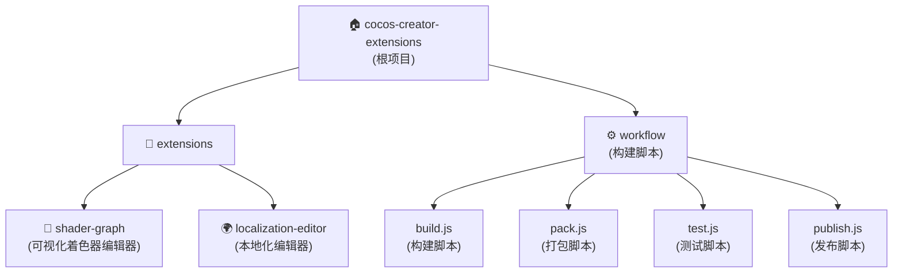

# Cocos Creator 扩展合集

[中文](./README.zh-CN.md)

## 变更记录 (Changelog)

### 2025-09-14 - 初始化架构文档
- 创建项目架构文档系统
- 分析两个核心扩展：shader-graph 和 localization-editor
- 建立模块化文档结构
- 生成自动化构建流程说明

---

## 项目愿景

Cocos Creator 扩展合集是一个开源的扩展插件库，旨在为 Cocos Creator 开发者提供高质量、实用的编辑器扩展工具。项目采用 monorepo 架构，支持多扩展协同开发，提供统一的构建、测试和发布流程。

## 架构总览

本项目采用模块化架构，每个扩展作为独立的模块进行开发和维护：

- **根级管理**：统一的包管理、构建脚本、CI/CD 配置
- **扩展模块**：各自独立的 package.json、源码、测试、文档
- **共享工作流**：通用的构建、测试、打包、发布脚本
- **版本控制**：自动化版本管理和 GitHub 发布

## 模块结构图



## 模块索引

| 模块名 | 路径 | 类型 | 版本 | 编辑器要求 | 描述 |
|--------|------|------|------|------------|------|
| [shader-graph](./extensions/shader-graph/CLAUDE.md) | `extensions/shader-graph` | Cocos扩展 | 1.0.0 | >=3.8.2 | 可视化着色器图形编辑器，支持节点式着色器创建 |
| [localization-editor](./extensions/localization-editor/CLAUDE.md) | `extensions/localization-editor` | Cocos扩展 | 1.0.4 | >=3.8.5 | 国际化本地化编辑器，支持多语言管理和自动翻译 |

## 运行与开发

### 初始化环境
```bash
# 克隆仓库
git clone https://github.com/cocos/cocos-creator-extensions.git
cd cocos-creator-extensions

# 安装依赖
npm install
```

### 开发流程
```bash
# 构建所有扩展
npm run build

# 构建特定扩展
npm run build --extension="shader-graph"

# 打包扩展
npm run pack

# 运行测试
npm run test
```

### 版本发布
```bash
# 补丁版本发布 (1.0.0 -> 1.0.1)
npm run release:patch

# 次要版本发布 (1.0.0 -> 1.1.0)
npm run release:minor

# 主要版本发布 (1.0.0 -> 2.0.0)
npm run release:major

# 发布特定版本
npm run release 1.2.3
```

## 测试策略

### 测试架构
- **单元测试**：各模块独立的单元测试，使用 Jest 或 Node.js test runner
- **集成测试**：扩展与 Cocos Creator 编辑器的集成测试
- **E2E测试**：完整工作流的端到端测试

### 测试覆盖
- **shader-graph**：基础测试覆盖，主要测试核心功能
- **localization-editor**：全面测试覆盖，包括服务层、仓库层、UI组件测试

## 编码规范

### TypeScript 规范
- 使用严格的 TypeScript 配置
- 遵循 ESLint 代码风格检查
- 使用依赖注入模式（tsyringe）进行解耦

### 项目结构规范
- 每个扩展遵循 Cocos Creator 扩展标准结构
- 使用 `src/` 存放源码，`dist/` 存放构建产物
- 测试文件放在 `tests/` 目录下

### 构建规范
- 使用 TypeScript 编译器或 Webpack 进行构建
- 支持开发模式监听和生产模式优化
- 统一的打包和发布流程

## AI 使用指引

### 开发建议
1. **模块化开发**：每个扩展独立开发，避免相互依赖
2. **类型安全**：充分利用 TypeScript 类型系统，提高代码质量
3. **测试驱动**：先写测试，后写实现，确保代码可靠性
4. **文档同步**：代码变更时同步更新相关文档

### 调试指南
- 使用 Cocos Creator 开发者工具进行调试
- 利用 `console.log` 和断点调试扩展行为
- 参考各模块的 README 了解特定调试方法

### 贡献指南
- Fork 仓库并创建功能分支
- 遵循现有的代码风格和提交规范
- 提交 Pull Request 前确保所有测试通过
- 更新相关文档和 CHANGELOG

---

*最后更新：2025-09-14*